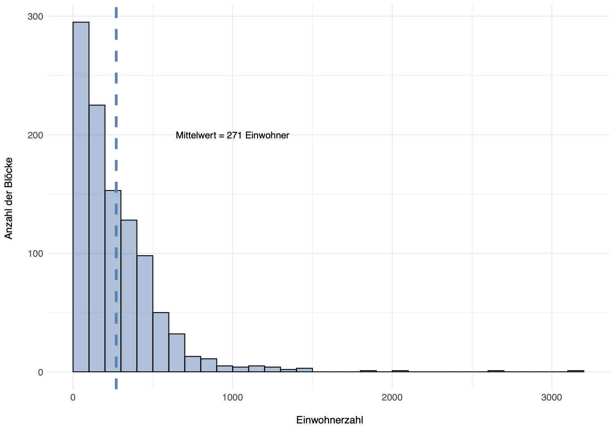
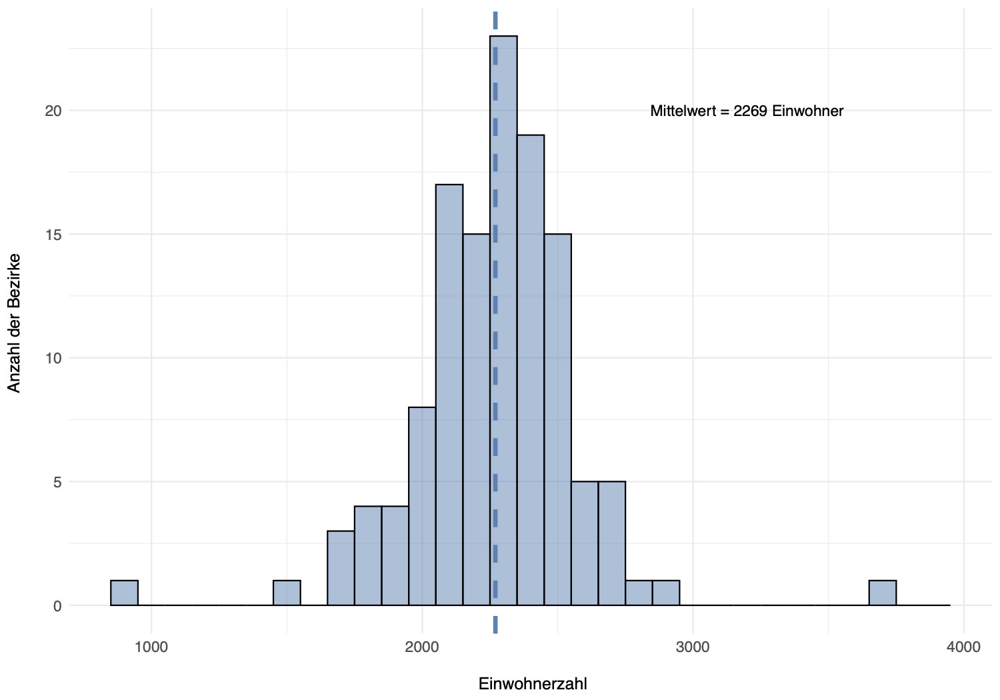

&nbsp;

### 1. Cleaning of Geographical Data

&nbsp;

The polygons within the shapefiles containing bloc-level and voting district-level information weren't fully compatible. The first step was to clean both datasets and to merge them in order to generate a shapefile containing all relevant information.

&nbsp;

#### 1.1 Removing Unpopulated Blocks

&nbsp;

Unpopulated blocs (displayed in blue) were removed from the dataset in order to simplify the analysis.

&nbsp;

**Figure 1: Unpopulated Blocs**

&nbsp;

#### 1.2 Redrawing Geodata

&nbsp;

Problematic overlaps (displayed in red) were corrected by redrawing the polygons of blocs/districts in QGis. Redrawing blocs was privileged over redrawing districts whenever possible.

&nbsp;

**Figure 2: Bloc Shapefile Polygons Overlapping with District Shapefile Polygons** 

&nbsp;

&nbsp;

### 2. Mapping Merged Dataset

&nbsp;

The merged dataset resulting from the data cleaning process contains  demographic data by bloc, geographic information by bloc as well as each bloc's voting district number. An additional shapefile layer containing the geographic information of the modified voting district polygons was also generated and mapped.

&nbsp;

There are **123 voting districts** and **1.032 inhabited blocs** in Tempelhof-Schönefeld .

**Figure 3: Voting Districts in Tempelhof-Schönefeld** <

&nbsp;

**Figure 4: Blocs in Tempelhof-Schönefeld**

&nbsp;

&nbsp;

### 3. Displaying Population Density 

&nbsp;

The redistricting guidelines request a maximum number of 2.500 residents per district. The population density by bloc and by district is displayed below.

&nbsp;

#### 3.1 Bloc-Level Population Density

&nbsp;

The average bloc density is 271 inhabitants. It is markedly right-skewed, with most blocs encompassing less than 500 inhabitants and some outliers encompassing a few thousands inhabitants.

&nbsp;

**Figure 5: Population Density by Bloc**

**Figure 6: Histogram of Population Density by Bloc**

#### 3.2 District-Level Population Density

&nbsp;

The average district-level density is 2.269 inhabitants. The distribution resembles a bell curve, with most observations centered around the average number of inhabitants.

&nbsp;

**Figure 7: Population Density by District**

&nbsp;

**Figure 8: Histogram of Population Density by District**

### 4. Preparing Data for Clustering Analysis 

&nbsp;

The next step is to prepare the data for the clustering analysis. To this end, the central point of each polygon has to be calculated and put in relation with all others.

&nbsp;

#### 4.1 Identifying Centroids of Bloc Polygons

&nbsp;

The centroid of each bloc was measured using the average longitude and latitude point of their respective polygon.

&nbsp;

**Figure 9: Centroids of Blocs**

#### 4.2 Identifying Closely Located Centroids

&nbsp;

For each centroid, the closest four other centroids were identified by Euclidean distance.

&nbsp;

**Figure 10: Neighbours of Centroids by Euclidean Distance**

&nbsp;

&nbsp;

&nbsp;

&nbsp;

